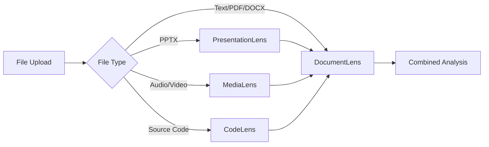

# DocumentLens

**Text Analysis & Academic Intelligence Microservice**

Transform text content into actionable insights through comprehensive linguistic analysis, writing quality assessment, and academic integrity checking.

## 🚀 Quick Start

```bash
# Setup
./start.sh

# API available at: http://localhost:8000
# Documentation: http://localhost:8000/api/docs
```

## 📊 API Endpoints

### Core Text Analysis
- `GET /api/health` - Service health check
- `POST /api/analyze` - Full text analysis (comprehensive)
- `POST /api/analyze/text` - Core text analysis only
- `POST /api/analyze/academic` - Academic features only

### Document Processing
- `POST /api/analyze/files` - File upload + text analysis
  - Supports: PDF, DOCX, TXT, Markdown
  - For presentations: Use [PresentationLens](https://github.com/michael-borck/presentation-lens)
  - For media files: Use [MediaLens](https://github.com/michael-borck/media-lens)

## 🎯 Use Cases

- **Text Analysis**: Readability, writing quality, word frequency for any text content
- **Academic Analysis**: Citation verification, DOI resolution, AI detection, integrity checking
- **Document Intelligence**: Extract and analyze text from PDFs and Word documents
- **Multi-Service Workflows**: Integrate with specialized analysis services

## 🏗️ Microservices Ecosystem

DocumentLens is part of a focused microservices architecture:

| Service | Purpose | Repository |
|---------|---------|------------|
| **DocumentLens** | Text analysis & academic intelligence | *This repo* |
| **PresentationLens** | Presentation design & structure analysis | [presentation-lens](https://github.com/michael-borck/presentation-lens) |
| **MediaLens** | Audio/video transcription & analysis | [media-lens](https://github.com/michael-borck/media-lens) |
| **CodeLens** | Source code quality & analysis | [code-lens](https://github.com/michael-borck/code-lens) |

### Integration Pattern


## 📚 Documentation

- `DOCUMENTLENS_SETUP.md` - Complete setup and usage instructions
- `docs/architecture/` - Microservices architecture documentation
- `docs/future-services/` - Service specifications and integration patterns

---

*DocumentLens: Pure text intelligence at the heart of content analysis*
