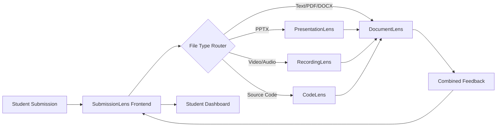

# DocumentLens

**Text Analysis & Academic Intelligence Microservice**

Transform text content into actionable insights through comprehensive linguistic analysis, writing quality assessment, and academic integrity checking.

## 🚀 Quick Start

```bash
# Docker deployment (recommended)
docker-compose up -d

# Or raw deployment
./deploy.sh

# API available at: http://localhost:8002
# Documentation: http://localhost:8002/docs
```

## 📊 API Endpoints

### Core Analysis (Clean Australian URLs)
- `GET /health` - Service health check
- `POST /text` - Text analysis (readability, quality, word frequency)
- `POST /academic` - Academic analysis (citations, DOI resolution, integrity)
- `POST /files` - File upload + analysis (PDF, DOCX, TXT, MD)

### Integration
- Root endpoint: `GET /` - Service info and available endpoints
- For presentations: Use [PresentationLens](https://github.com/michael-borck/presentation-lens)
- For recordings: Use [RecordingLens](https://github.com/michael-borck/recording-lens)

## 🎯 Use Cases

- **Text Analysis**: Readability, writing quality, word frequency for any text content
- **Academic Analysis**: Citation verification, DOI resolution, AI detection, integrity checking
- **Document Intelligence**: Extract and analyze text from PDFs and Word documents
- **Multi-Service Workflows**: Integrate with specialized analysis services

## 🏗️ Microservices Ecosystem

DocumentLens is part of a focused microservices architecture:

| Service | Purpose | Repository |
|---------|---------|------------|
| **DocumentLens** | Text analysis & academic intelligence | *This repo* |
| **PresentationLens** | Presentation design & structure analysis | [presentation-lens](https://github.com/michael-borck/presentation-lens) |
| **RecordingLens** | Student recordings (video/audio) analysis | [recording-lens](https://github.com/michael-borck/recording-lens) |
| **CodeLens** | Source code quality & analysis | [code-lens](https://github.com/michael-borck/code-lens) |
| **SubmissionLens** | Student submission router & frontend | [submission-lens](https://github.com/michael-borck/submission-lens) |

### Integration Pattern


## 🚀 Deployment

### Docker Deployment (Recommended)
```bash
git clone https://github.com/michael-borck/document-lens.git
cd document-lens
docker-compose up -d  # Single container deployment
```

### Raw/Native Deployment
```bash
git clone https://github.com/michael-borck/document-lens.git
cd document-lens
./deploy.sh  # Handles venv, dependencies, and production server
```

## 📚 Documentation

- `DEPLOYMENT.md` - Deployment guide for Docker and raw installations
- `DOCUMENTLENS_SETUP.md` - Setup and usage instructions
- `.env.example` - Configuration template
- `docs/` - Additional architecture and integration documentation

---

*DocumentLens: Pure text intelligence at the heart of content analysis*
