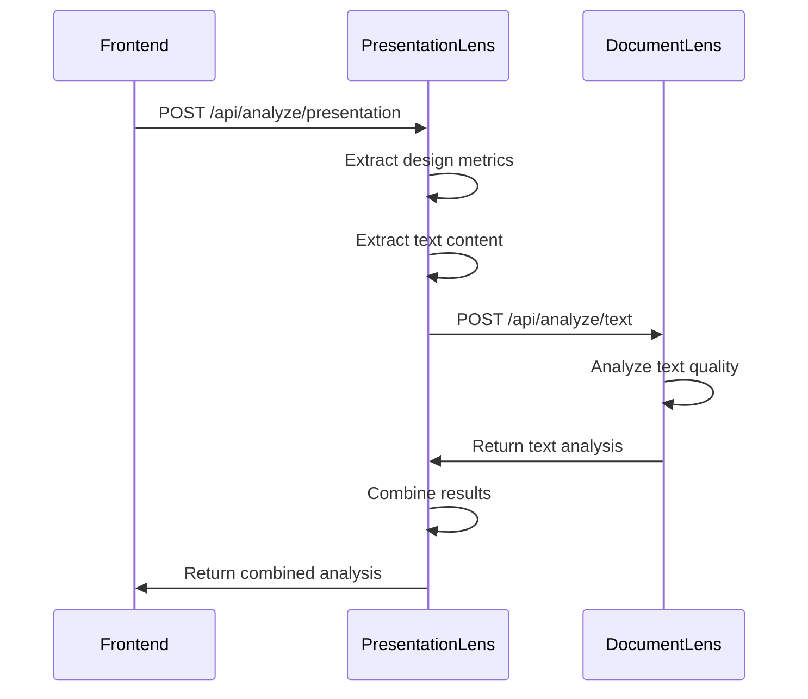
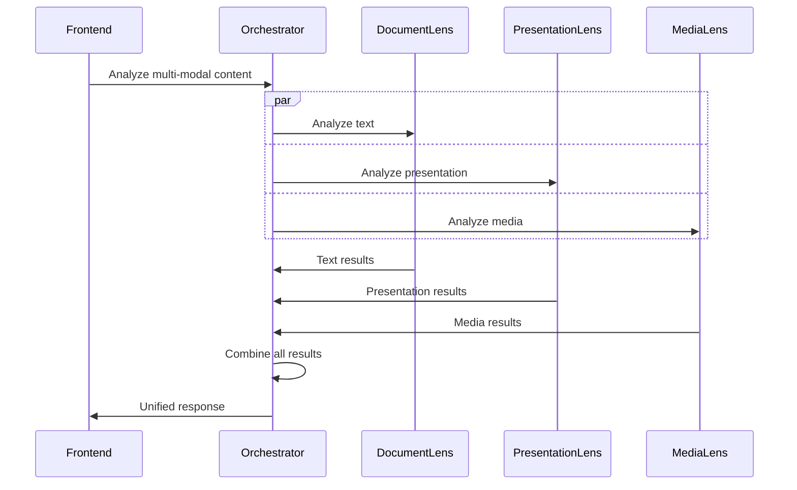
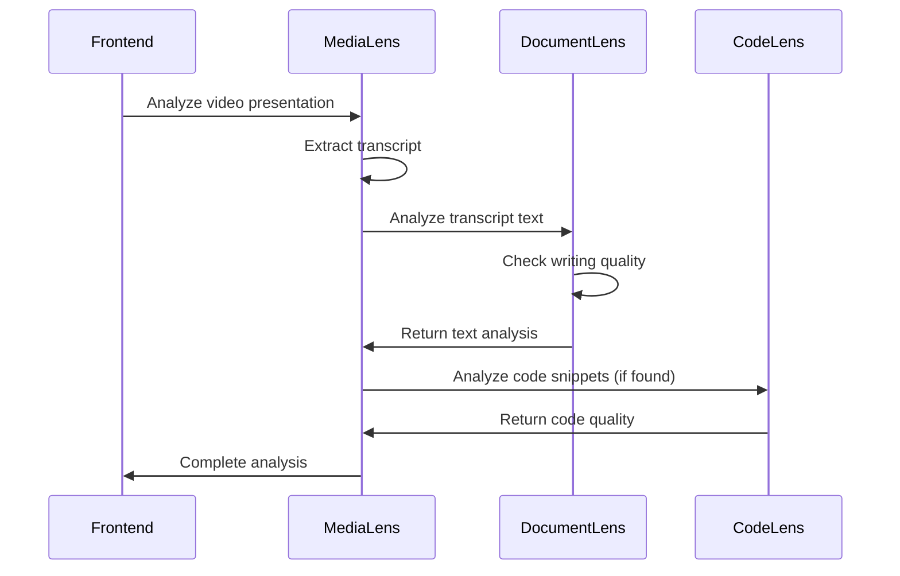

# API Orchestration: Service Integration Patterns

## Overview

This document defines how services in the DocumentLens ecosystem communicate, coordinate, and share data to provide comprehensive content analysis. The orchestration patterns ensure scalable, maintainable, and user-friendly multi-service workflows.

## Service Communication Patterns

### 1. Direct Integration Pattern

**Use Case**: Text extraction followed by linguistic analysis



**Benefits:**
- Services directly communicate for efficiency
- Reduced frontend complexity
- Centralized result combination

**Implementation:**
```python
# PresentationLens service
async def analyze_presentation(file):
    # Perform presentation analysis
    presentation_results = await self.analyze_design(file)
    extracted_text = await self.extract_text(file)
    
    # Call DocumentLens for text analysis
    text_results = await self.document_lens_client.analyze_text(extracted_text)
    
    # Combine and return
    return self.combine_results(presentation_results, text_results)
```

### 2. Fan-out Orchestration Pattern

**Use Case**: Parallel independent analyses with result aggregation



**Benefits:**
- Maximum parallelization
- Independent service scaling
- Centralized error handling

### 3. Pipeline Orchestration Pattern

**Use Case**: Sequential analysis with dependencies



## API Contract Standards

### 1. Request/Response Format

**Standard Request Structure:**
```json
{
    "content": "file_content_or_text",
    "options": {
        "analysis_depth": "full|quick|basic",
        "include_suggestions": true,
        "format_output": "detailed|summary",
        "callback_url": "https://callback.example.com/results"
    },
    "metadata": {
        "user_id": "user123",
        "session_id": "sess456", 
        "content_type": "presentation|document|media|code",
        "source": "upload|url|api"
    }
}
```

**Standard Response Structure:**
```json
{
    "status": "success|error|partial",
    "results": {
        "service_specific_data": "...",
        "confidence_score": 0.95,
        "processing_time": 12.3
    },
    "metadata": {
        "service": "document-lens",
        "version": "1.0.0", 
        "timestamp": "2024-01-01T12:00:00Z",
        "request_id": "req789"
    },
    "errors": [],
    "warnings": [],
    "suggestions": []
}
```

### 2. Error Handling Standards

**Standardized Error Responses:**
```json
{
    "status": "error",
    "error": {
        "code": "PROCESSING_FAILED",
        "message": "Unable to process file",
        "details": "File format not supported",
        "retry_possible": true,
        "suggested_action": "Try converting to supported format"
    },
    "partial_results": {},
    "request_id": "req789"
}
```

**Error Code Categories:**
- **1xxx**: Authentication/Authorization errors
- **2xxx**: Input validation errors  
- **3xxx**: Processing errors
- **4xxx**: Integration errors (service unavailable)
- **5xxx**: System errors (internal server errors)

### 3. Health Check Protocol

**Standard Health Check Endpoint:**
```http
GET /health

Response:
{
    "status": "healthy|degraded|unhealthy",
    "version": "1.0.0",
    "uptime": 86400,
    "dependencies": {
        "document-lens": "healthy",
        "database": "healthy", 
        "external-api": "degraded"
    },
    "metrics": {
        "cpu_usage": 45.2,
        "memory_usage": 67.8,
        "active_requests": 12
    }
}
```

## Service Discovery & Registration

### 1. Service Registry Pattern

**Central Service Registry:**
```json
{
    "services": [
        {
            "name": "document-lens",
            "version": "1.0.0",
            "base_url": "https://document-lens.api.com",
            "endpoints": [
                {
                    "path": "/api/analyze/text",
                    "methods": ["POST"],
                    "description": "Analyze text content"
                }
            ],
            "health_check": "/health",
            "capabilities": ["text_analysis", "readability", "academic_integrity"],
            "max_file_size": "10MB",
            "supported_formats": ["text/plain", "application/json"]
        }
    ]
}
```

**Dynamic Service Discovery:**
```javascript
class ServiceRegistry {
    constructor() {
        this.services = new Map();
        this.updateInterval = 60000; // 1 minute
    }
    
    async discoverServices() {
        const response = await fetch('/api/registry/services');
        const registry = await response.json();
        
        for (const service of registry.services) {
            await this.registerService(service);
        }
    }
    
    async getService(serviceName) {
        const service = this.services.get(serviceName);
        
        if (!service) {
            throw new Error(`Service ${serviceName} not found`);
        }
        
        if (service.status !== 'healthy') {
            throw new Error(`Service ${serviceName} is ${service.status}`);
        }
        
        return service;
    }
}
```

### 2. Service Mesh Integration

**Istio Service Mesh Configuration:**
```yaml
# Service mesh configuration for service discovery
apiVersion: networking.istio.io/v1beta1
kind: ServiceEntry
metadata:
  name: document-lens
spec:
  hosts:
  - document-lens.internal
  ports:
  - number: 8000
    name: http
    protocol: HTTP
  location: MESH_INTERNAL
  resolution: DNS
```

## Data Flow Patterns

### 1. Text Extraction Pipeline

```python
class TextExtractionPipeline:
    async def extract_and_analyze(self, file, file_type):
        if file_type == 'presentation':
            # Extract from presentation
            presentation_service = await self.get_service('presentation-lens')
            extraction_result = await presentation_service.extract_text(file)
            
        elif file_type == 'media':
            # Extract from audio/video
            media_service = await self.get_service('media-lens') 
            extraction_result = await media_service.transcribe(file)
            
        elif file_type == 'code':
            # Extract comments and documentation
            code_service = await self.get_service('code-lens')
            extraction_result = await code_service.extract_docs(file)
            
        # Analyze extracted text
        document_service = await self.get_service('document-lens')
        analysis_result = await document_service.analyze_text(
            extraction_result.text
        )
        
        return self.combine_results(extraction_result, analysis_result)
```

### 2. Result Aggregation Pipeline

```python
class ResultAggregator:
    async def aggregate_analyses(self, file, requested_services):
        results = {}
        errors = []
        
        # Execute analyses in parallel where possible
        tasks = []
        for service_name in requested_services:
            if self.is_independent_analysis(service_name):
                task = self.execute_service_analysis(service_name, file)
                tasks.append((service_name, task))
        
        # Wait for independent analyses
        for service_name, task in tasks:
            try:
                results[service_name] = await task
            except Exception as e:
                errors.append(f"{service_name}: {str(e)}")
        
        # Execute dependent analyses
        dependent_services = self.get_dependent_services(requested_services)
        for service_name in dependent_services:
            try:
                dependency_data = self.extract_dependency_data(
                    service_name, results
                )
                result = await self.execute_dependent_analysis(
                    service_name, file, dependency_data
                )
                results[service_name] = result
            except Exception as e:
                errors.append(f"{service_name}: {str(e)}")
        
        return self.create_unified_response(results, errors)
```

## Authentication & Authorization

### 1. Inter-Service Authentication

**Service-to-Service JWT Pattern:**
```python
class InterServiceAuth:
    def __init__(self, service_name, private_key):
        self.service_name = service_name
        self.private_key = private_key
    
    def create_service_token(self, target_service):
        payload = {
            'iss': self.service_name,
            'aud': target_service, 
            'iat': int(time.time()),
            'exp': int(time.time()) + 300,  # 5 minutes
            'scope': 'service-to-service'
        }
        
        return jwt.encode(payload, self.private_key, algorithm='RS256')
    
    async def call_service(self, service_name, endpoint, data):
        token = self.create_service_token(service_name)
        
        async with httpx.AsyncClient() as client:
            response = await client.post(
                f"{service_url}{endpoint}",
                json=data,
                headers={'Authorization': f'Bearer {token}'}
            )
            
            return response.json()
```

### 2. User Context Propagation

**Request Context Forwarding:**
```python
class ContextPropagator:
    def extract_user_context(self, request):
        return {
            'user_id': request.headers.get('X-User-ID'),
            'session_id': request.headers.get('X-Session-ID'),
            'organization_id': request.headers.get('X-Org-ID'),
            'permissions': request.headers.get('X-Permissions', '').split(',')
        }
    
    def create_forwarding_headers(self, context):
        return {
            'X-User-ID': context['user_id'],
            'X-Session-ID': context['session_id'], 
            'X-Org-ID': context['organization_id'],
            'X-Permissions': ','.join(context['permissions'])
        }
```

## Caching Strategies

### 1. Multi-Level Caching

```python
class CacheOrchestrator:
    def __init__(self):
        self.local_cache = LRUCache(maxsize=100)
        self.redis_cache = RedisCache()
        self.cdn_cache = CDNCache()
    
    async def get_cached_result(self, cache_key, cache_level='auto'):
        # Level 1: Local cache (fastest)
        if cache_level in ['auto', 'local']:
            result = self.local_cache.get(cache_key)
            if result:
                return result
        
        # Level 2: Redis cache (fast)  
        if cache_level in ['auto', 'redis']:
            result = await self.redis_cache.get(cache_key)
            if result:
                # Populate local cache
                self.local_cache.put(cache_key, result)
                return result
        
        # Level 3: CDN cache (for static results)
        if cache_level in ['auto', 'cdn']:
            result = await self.cdn_cache.get(cache_key) 
            if result:
                # Populate upstream caches
                await self.redis_cache.put(cache_key, result)
                self.local_cache.put(cache_key, result)
                return result
        
        return None
    
    def generate_cache_key(self, content, analysis_type, options):
        # Create deterministic cache key
        content_hash = hashlib.sha256(content.encode()).hexdigest()[:16]
        options_hash = hashlib.sha256(
            json.dumps(options, sort_keys=True).encode()
        ).hexdigest()[:8]
        
        return f"{analysis_type}:{content_hash}:{options_hash}"
```

### 2. Intelligent Cache Invalidation

```python
class CacheInvalidator:
    async def invalidate_dependent_caches(self, service_updated):
        # Define cache dependencies
        dependencies = {
            'document-lens': ['combined-analysis', 'text-analysis'],
            'presentation-lens': ['combined-analysis', 'presentation-analysis'],
            'media-lens': ['combined-analysis', 'media-analysis']
        }
        
        # Invalidate dependent caches
        for cache_pattern in dependencies.get(service_updated, []):
            await self.invalidate_cache_pattern(cache_pattern)
    
    async def invalidate_cache_pattern(self, pattern):
        # Use Redis SCAN to find matching keys
        async for key in self.redis_cache.scan_iter(match=f"{pattern}:*"):
            await self.redis_cache.delete(key)
```

## Rate Limiting & Throttling

### 1. Service-Level Rate Limiting

```python
class RateLimiter:
    def __init__(self, redis_client):
        self.redis = redis_client
    
    async def check_rate_limit(self, service_name, client_id, limit_per_minute=60):
        key = f"rate_limit:{service_name}:{client_id}"
        
        # Sliding window rate limiting
        now = int(time.time())
        window_start = now - 60  # 1 minute window
        
        # Remove old entries
        await self.redis.zremrangebyscore(key, 0, window_start)
        
        # Count current requests
        current_count = await self.redis.zcard(key)
        
        if current_count >= limit_per_minute:
            raise RateLimitExceeded(
                f"Rate limit exceeded for {service_name}: "
                f"{current_count}/{limit_per_minute} requests per minute"
            )
        
        # Add current request
        await self.redis.zadd(key, {str(now): now})
        await self.redis.expire(key, 60)
        
        return True
```

### 2. Adaptive Rate Limiting

```python
class AdaptiveRateLimiter:
    async def get_dynamic_rate_limit(self, service_name):
        # Check service health and load
        health_response = await self.check_service_health(service_name)
        
        base_limit = 100  # Base rate limit per minute
        
        if health_response['status'] == 'healthy':
            cpu_usage = health_response['metrics']['cpu_usage']
            
            # Reduce rate limit based on CPU usage
            if cpu_usage > 80:
                return int(base_limit * 0.5)  # Reduce to 50%
            elif cpu_usage > 60:
                return int(base_limit * 0.7)  # Reduce to 70%
            else:
                return base_limit
        else:
            return int(base_limit * 0.3)  # Severely limited if unhealthy
```

## Monitoring & Observability

### 1. Distributed Tracing

```python
from opentelemetry import trace
from opentelemetry.exporter.jaeger.thrift import JaegerExporter
from opentelemetry.sdk.trace import TracerProvider

class TracingOrchestrator:
    def __init__(self):
        self.tracer = trace.get_tracer(__name__)
    
    async def traced_service_call(self, service_name, operation, data):
        with self.tracer.start_as_current_span(
            f"{service_name}.{operation}"
        ) as span:
            # Add span attributes
            span.set_attribute("service.name", service_name)
            span.set_attribute("operation", operation)
            span.set_attribute("data.size", len(str(data)))
            
            try:
                start_time = time.time()
                result = await self.call_service(service_name, operation, data)
                
                # Add success metrics
                span.set_attribute("success", True)
                span.set_attribute("duration", time.time() - start_time)
                
                return result
                
            except Exception as e:
                # Record error
                span.set_status(trace.Status(trace.StatusCode.ERROR, str(e)))
                span.set_attribute("success", False)
                span.set_attribute("error", str(e))
                raise
```

### 2. Metrics Collection

```python
from prometheus_client import Counter, Histogram, Gauge

# Define metrics
request_count = Counter(
    'service_requests_total',
    'Total service requests', 
    ['service', 'method', 'status']
)

request_duration = Histogram(
    'service_request_duration_seconds',
    'Service request duration',
    ['service', 'method']
)

active_connections = Gauge(
    'service_active_connections',
    'Active connections to services',
    ['service']
)

class MetricsCollector:
    async def record_service_call(self, service_name, method, duration, success):
        status = 'success' if success else 'error'
        
        request_count.labels(
            service=service_name, 
            method=method, 
            status=status
        ).inc()
        
        request_duration.labels(
            service=service_name,
            method=method
        ).observe(duration)
```

---

**This orchestration framework ensures reliable, scalable, and observable communication between all services in the DocumentLens ecosystem while maintaining flexibility for various integration patterns.**