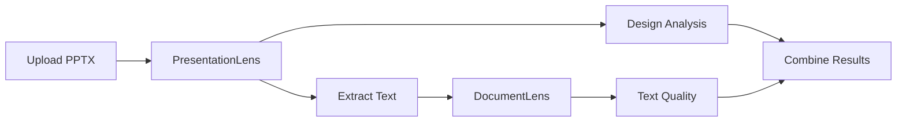
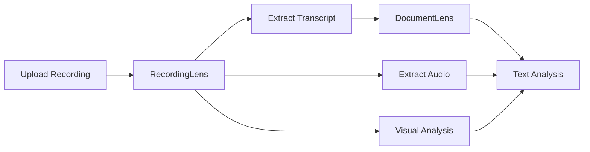

# DocumentLens Ecosystem: Microservices Architecture

## Overview

The DocumentLens ecosystem is designed as a collection of specialized microservices, each focused on a specific domain of content analysis. This architecture enables independent scaling, technology choices, and development cycles while maintaining clean integration patterns.

## Service Portfolio

### 1. DocumentLens 📝 (This Repository)
**Purpose**: Pure text analysis and linguistic intelligence
- **Focus**: Deep text analysis, readability, writing quality, academic integrity
- **Input**: Plain text or text extracted by other services
- **Unique Value**: NLP analysis, citation checking, AI detection, academic tone
- **Technology**: FastAPI, Python, NLTK, async processing

### 2. CodeLens 💻 (Separate Repository)
**Purpose**: Source code analysis and quality metrics
- **Focus**: Code quality, complexity, patterns, security
- **Status**: In active development
- **Integration**: Can analyze code comments and documentation via DocumentLens

### 3. PresentationLens 🎯 (Future Service)
**Purpose**: Presentation-specific analysis
- **Focus**: Slide design, visual balance, presentation effectiveness
- **Features**: 5x5 rule, 10-20-30 rule, speaker notes analysis
- **Integration**: Extracts text → DocumentLens for linguistic analysis

### 4. RecordingLens 🎬 (Future Service)
**Purpose**: Recorded audio and video content analysis
- **Focus**: Student submissions - recorded presentations, interviews, podcasts
- **Features**: Transcription, speech quality, pacing analysis, accessibility metrics
- **Integration**: Generates transcripts → DocumentLens for text analysis

### 5. SubmissionLens 🎼 (Frontend Orchestrator)
**Purpose**: Student submission router and workflow coordinator
- **Focus**: Smart routing, progress tracking, result aggregation
- **Role**: User-facing application that manages the complete submission-to-feedback pipeline

## Architecture Principles

### 1. Single Responsibility
Each service has a narrow, well-defined domain of expertise:
- DocumentLens: Text intelligence only
- PresentationLens: Presentation structure and design
- RecordingLens: Recorded audio/video processing
- CodeLens: Source code analysis

### 2. Clean Integration
Services communicate through well-defined REST APIs:
```
File Upload → Specialized Service → Text Extraction → DocumentLens → Combined Results
```

### 3. Technology Freedom
Each service can choose optimal technologies:
- DocumentLens: FastAPI + NLTK for text processing
- PresentationLens: python-pptx + OpenCV for visual analysis
- RecordingLens: FFmpeg + Whisper for recorded content processing
- CodeLens: Language-specific parsers and AST tools

### 4. Independent Deployment
- Each service has its own repository and CI/CD pipeline
- Services can be scaled independently based on demand
- Updates don't require coordinated releases

## Integration Patterns

### Pattern 1: Extract-Then-Analyze


### Pattern 2: Parallel Processing


### Pattern 3: Progressive Enhancement
1. Basic analysis (fast, always available)
2. Enhanced analysis (slower, optional)
3. Cross-service insights (combining multiple analyses)

## Service Communication

### API Standards
- REST APIs with OpenAPI documentation
- Consistent response formats
- Standard error handling
- Health check endpoints

### Data Flow
- Services never directly access each other's databases
- All communication through API calls
- Results cached at orchestrator level
- Async processing for heavy operations

### Authentication & Security
- API key authentication between services
- Rate limiting per service
- Input validation and sanitization
- Secure handling of uploaded files

## Deployment Architecture

### Development
- Local development with docker-compose
- Each service in its own container
- Shared volumes for file processing

### Production
- Kubernetes with service mesh (Istio)
- Independent scaling based on usage
- Circuit breakers for fault tolerance
- Distributed tracing for debugging

## Benefits of This Architecture

### 1. Scalability
- Scale text analysis independently from media processing
- Different services have different computational needs
- Can optimize infrastructure per service type

### 2. Maintainability
- Smaller, focused codebases
- Independent team ownership
- Clear boundaries and responsibilities
- Easier testing and debugging

### 3. Flexibility
- Can add new analysis types without modifying existing services
- Technology choices per service domain
- Gradual migration and updates

### 4. Reliability
- Failure in one service doesn't cascade
- Graceful degradation possible
- Independent monitoring and alerting

## Migration Strategy

### Phase 1: Document Current State
- ✅ DocumentLens: Feature-complete text analysis
- ✅ CodeLens: In separate development
- 📝 Document future services (this phase)

### Phase 2: Extract Presentation Logic
- Remove PPTX handling from DocumentLens
- Create PresentationLens specification
- Maintain backward compatibility during transition

### Phase 3: Recording Service Planning
- Define RecordingLens requirements for student submissions
- Plan integration with existing transcription services
- Design batch processing APIs for recorded content analysis

### Phase 4: SubmissionLens Development
- Implement student submission routing and workflow management
- Create result aggregation and progress tracking
- Add caching and optimization

## Success Metrics

- **Performance**: Each service optimized for its domain
- **Reliability**: Independent failure modes
- **Developer Experience**: Clear APIs and documentation
- **User Experience**: Seamless multi-modal analysis
- **Operational**: Easy deployment and monitoring

## Future Considerations

### Additional Services
- **DocumentLens-Legal**: Legal document analysis
- **DocumentLens-Medical**: Medical text analysis
- **DocumentLens-Financial**: Financial document processing

### Advanced Features
- Real-time collaborative analysis
- ML model sharing between services
- Federated learning across services
- Multi-tenant isolation

---

*This architecture enables the DocumentLens ecosystem to grow organically while maintaining clean separation of concerns and optimal technology choices for each domain.*