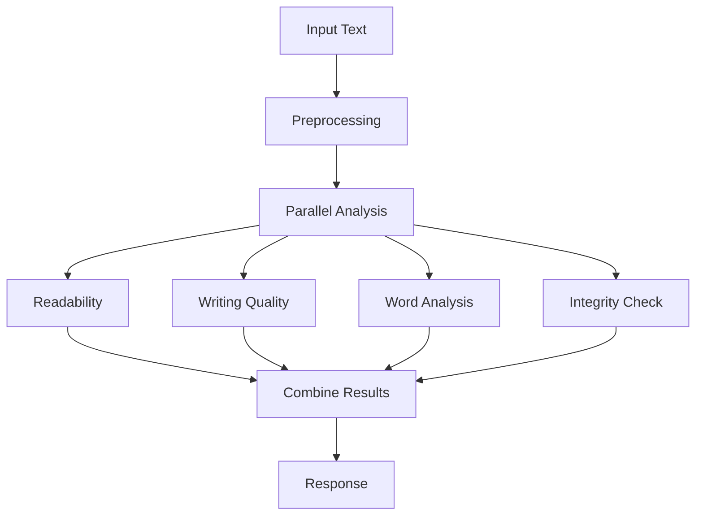
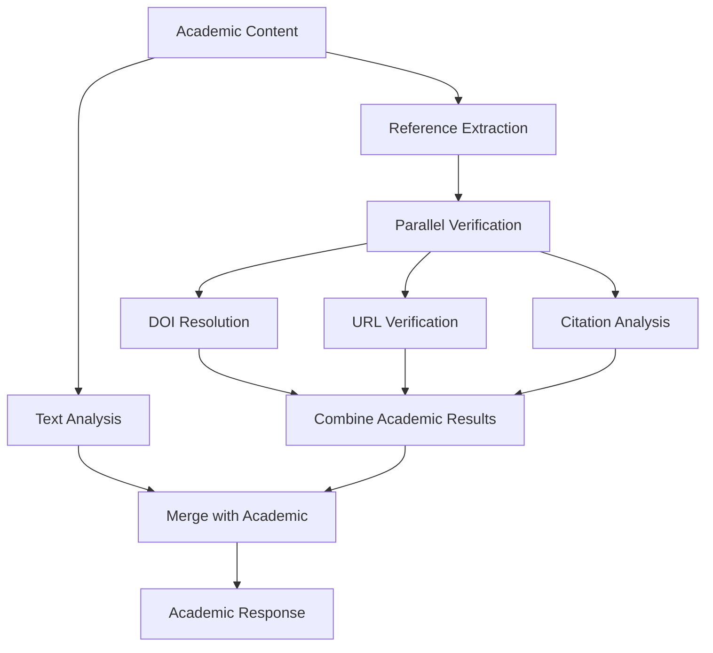

# DocumentLens Architecture Overview

## Service Purpose

**DocumentLens** is a specialized microservice focused on text analysis and academic intelligence. It provides deep linguistic analysis, writing quality assessment, academic integrity checking, and citation validation.

## Core Responsibilities

### 🔍 Text Analysis
- **Readability Assessment**: Flesch scores, grade level analysis, sentence complexity
- **Writing Quality**: Passive voice detection, sentence variety, transition words, academic tone
- **Word Analysis**: Frequency analysis, vocabulary richness, n-gram extraction
- **Linguistic Patterns**: Style consistency, spelling variants, technical language usage

### 🎓 Academic Intelligence  
- **Citation Analysis**: Reference extraction, citation style detection, completeness checking
- **DOI Resolution**: CrossRef integration, metadata retrieval, accessibility validation
- **URL Verification**: Link checking, redirect detection, availability status
- **Integrity Checking**: AI-generated content detection, plagiarism indicators, style anomalies

### 📄 Document Processing
- **Multi-format Support**: PDF, DOCX, TXT, Markdown text extraction
- **Content Normalization**: Clean text preparation for analysis
- **Metadata Extraction**: Document properties, structural information

## Technical Architecture

### Application Structure
```
app/
├── analyzers/           # Core analysis engines
│   ├── integrity_checker.py    # AI detection, plagiarism
│   ├── readability.py          # Readability metrics  
│   ├── word_analysis.py        # Word frequency, n-grams
│   └── writing_quality.py      # Style, tone analysis
├── services/            # External integrations
│   ├── document_processor.py   # File processing
│   ├── doi_resolver.py        # DOI resolution
│   ├── reference_extractor.py  # Citation extraction
│   └── url_verifier.py        # URL validation
├── api/                # REST API endpoints
│   └── routes/
│       ├── analysis.py        # Main analysis endpoints
│       ├── academic_analysis.py # Academic-specific analysis
│       └── health.py          # Health checks
└── models/             # Data schemas
    └── schemas.py      # Pydantic models
```

### Technology Stack

#### Core Framework
- **FastAPI**: Async web framework with automatic OpenAPI documentation
- **Pydantic**: Data validation and serialization
- **Python 3.11+**: Modern Python with type annotations

#### Text Processing
- **NLTK**: Natural language processing toolkit
- **textstat**: Readability and text statistics
- **scikit-learn**: Machine learning for text analysis
- **Regular Expressions**: Pattern matching and extraction

#### External Integrations
- **httpx**: Async HTTP client for API calls
- **PyPDF2/pdfplumber**: PDF text extraction
- **python-docx**: Word document processing
- **CrossRef API**: DOI resolution and metadata

#### Data & Caching
- **In-memory caching**: For DOI resolution and URL verification
- **JSON configuration**: AI patterns and analysis parameters
- **Async processing**: Non-blocking operations for external APIs

## API Design Principles

### 1. Focused Endpoints
Each endpoint has a single, clear responsibility:
- `/api/analyze/text` - Pure text analysis
- `/api/analyze/academic` - Academic-specific features
- `/api/analyze/files` - Document processing + analysis

### 2. Consistent Response Format
```json
{
    "status": "success|error|partial",
    "results": {
        "analysis_type": "specific_data",
        "confidence_score": 0.95,
        "processing_time": 2.3
    },
    "metadata": {
        "service": "document-lens",
        "version": "1.0.0",
        "timestamp": "2024-01-01T12:00:00Z"
    },
    "errors": [],
    "warnings": []
}
```

### 3. Async Operations
- Non-blocking DOI resolution
- Concurrent URL verification  
- Parallel analysis execution
- Rate limiting with semaphores

## Integration Patterns

### 1. Standalone Operation
DocumentLens can operate independently for pure text analysis:
```
Text Input → DocumentLens → Analysis Results
```

### 2. Service Integration
Other services can extract text and send to DocumentLens:
```
PPTX → PresentationLens → Extract Text → DocumentLens → Combined Results
Video → RecordingLens → Transcript → DocumentLens → Combined Results
```

### 3. Frontend Integration
SubmissionLens routes appropriate content to DocumentLens:
```
Student Submission → SubmissionLens → Route to DocumentLens → Aggregated Feedback
```

## Data Flow

### Text Analysis Pipeline


### Academic Analysis Pipeline


## Performance Characteristics

### Response Times (Target)
- **Text Analysis**: < 2 seconds for typical documents (1000-5000 words)
- **Academic Analysis**: < 5 seconds including external API calls
- **File Processing**: < 10 seconds for typical PDF/DOCX files

### Scalability
- **Stateless Design**: Horizontal scaling friendly
- **Async Processing**: Efficient resource utilization
- **Caching Strategy**: Reduced external API calls
- **Rate Limiting**: Prevents external service overload

### Resource Usage
- **Memory**: ~500MB baseline, scales with document size
- **CPU**: Moderate usage during text processing
- **Network**: Depends on DOI/URL verification volume
- **Storage**: Minimal (no persistent data storage)

## Security Considerations

### Input Validation
- **File Type Verification**: Strict content-type checking
- **Size Limits**: Prevent resource exhaustion
- **Content Sanitization**: Clean text extraction
- **Rate Limiting**: Prevent abuse

### External API Security
- **API Key Management**: Secure credential storage
- **Request Signing**: Authenticated service calls
- **Timeout Handling**: Prevent hanging requests
- **Error Sanitization**: No sensitive data in error messages

## Monitoring & Observability

### Health Checks
- **Basic Health**: Service availability
- **Dependency Health**: External API status
- **Resource Health**: Memory and CPU usage

### Metrics
- **Request Counts**: Analysis volume and types
- **Response Times**: Performance monitoring
- **Error Rates**: Failure tracking
- **Cache Hit Rates**: Optimization insights

### Logging
- **Structured Logging**: JSON format with consistent fields
- **Request Tracing**: Track analysis workflows
- **Error Logging**: Detailed error context
- **Performance Logging**: Response time analytics

## Quality Assurance

### Testing Strategy
- **Unit Tests**: Individual analyzer and service testing
- **Integration Tests**: API endpoint testing
- **Performance Tests**: Load and stress testing
- **Contract Tests**: API compatibility verification

### Code Quality
- **Type Annotations**: Full static type checking with mypy
- **Linting**: Code style enforcement with ruff
- **Documentation**: Comprehensive API documentation
- **Test Coverage**: >90% test coverage target

---

DocumentLens provides the foundation for intelligent text analysis within the broader educational content analysis ecosystem, focusing on excellence in linguistic analysis and academic integrity.