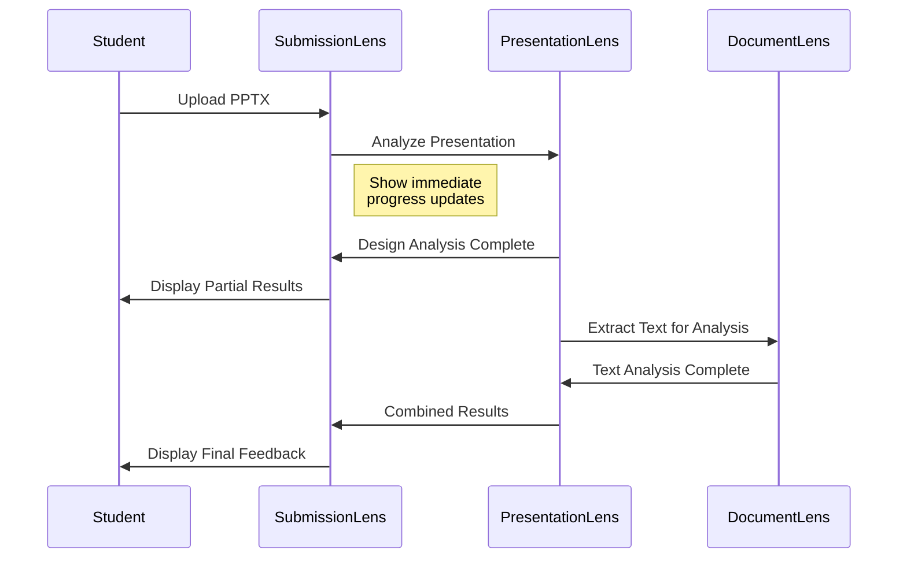

# SubmissionLens: Student Submission Router & Frontend

## Service Overview

**SubmissionLens** is the user-facing frontend application that serves as the intelligent router and workflow coordinator for the DocumentLens ecosystem. It manages the complete student submission-to-feedback pipeline, providing a seamless experience for students submitting various types of content for analysis.

## Core Purpose

**SubmissionLens** acts as the central hub that:
- **Smart Routes**: Automatically directs submissions to appropriate analysis services
- **Orchestrates Workflows**: Manages multi-step analysis processes
- **Aggregates Results**: Combines insights from multiple services into unified feedback
- **Tracks Progress**: Provides real-time updates during analysis
- **Manages History**: Maintains submission history and analytics

## Key Features

### 1. Intelligent File Routing

#### Automatic Content Detection
- **File Type Recognition**: Analyzes file extensions, MIME types, and content structure
- **Content Classification**: Identifies document types (essay, presentation, code, recording)
- **Service Mapping**: Routes to appropriate analysis service automatically
- **Multi-format Support**: Handles mixed submissions (e.g., presentation with accompanying notes)

#### Smart Routing Logic
```javascript
// Example routing logic
const routeSubmission = (file) => {
    const routes = {
        'pdf|docx|txt|md': 'DocumentLens',
        'pptx|ppt|odp': 'PresentationLens',
        'mp4|mov|avi|mp3|wav': 'RecordingLens', 
        'py|js|java|cpp|cs': 'CodeLens'
    };
    
    return determineOptimalPath(file, routes);
};
```

### 2. Student-Centric Interface

#### Submission Dashboard
- **Drag & Drop Upload**: Intuitive file submission interface
- **Progress Tracking**: Real-time analysis status with estimated completion times
- **Result Visualization**: Clear, actionable feedback presentation
- **History Timeline**: View past submissions and improvements over time

#### Assignment Integration
- **LMS Connection**: Integration with Canvas, Blackboard, Moodle
- **Assignment Context**: Links submissions to specific course assignments
- **Rubric Integration**: Aligns feedback with assignment rubrics
- **Grade Passback**: Seamlessly returns scores to LMS gradebooks

### 3. Multi-Service Orchestration

#### Workflow Management
- **Sequential Processing**: Handle dependencies between services (e.g., PresentationLens → DocumentLens)
- **Parallel Processing**: Execute independent analyses simultaneously
- **Error Recovery**: Graceful handling of service failures with fallback options
- **Result Caching**: Cache intermediate and final results for performance

#### Progressive Enhancement


## User Experience Design

### 1. Submission Flow

#### Step 1: Upload Interface
```html
<div class="submission-zone">
    <h2>Submit Your Work</h2>
    <div class="drag-drop-area">
        <p>Drag files here or click to browse</p>
        <input type="file" multiple accept="*/*" />
    </div>
    
    <div class="submission-details">
        <select name="assignment">
            <option>Select Assignment</option>
            <option>Final Presentation</option>
            <option>Research Paper</option>
        </select>
        
        <textarea placeholder="Optional notes about your submission..."></textarea>
    </div>
</div>
```

#### Step 2: Analysis Progress
```html
<div class="analysis-progress">
    <h3>Analyzing Your Submission</h3>
    
    <div class="progress-steps">
        <div class="step completed">
            <span class="step-icon">📄</span>
            <span class="step-text">File Processing</span>
        </div>
        <div class="step active">
            <span class="step-icon">🎨</span>
            <span class="step-text">Design Analysis</span>
            <div class="progress-bar">
                <div class="progress" style="width: 65%"></div>
            </div>
        </div>
        <div class="step pending">
            <span class="step-icon">📝</span>
            <span class="step-text">Text Analysis</span>
        </div>
    </div>
</div>
```

#### Step 3: Results Dashboard
```html
<div class="results-dashboard">
    <div class="overall-score">
        <h2>Overall Score: 85/100</h2>
        <div class="score-breakdown">
            <div class="score-item">
                <span>Content Quality</span>
                <span class="score">92/100</span>
            </div>
            <div class="score-item">
                <span>Design & Structure</span>
                <span class="score">78/100</span>
            </div>
        </div>
    </div>
    
    <div class="feedback-sections">
        <div class="feedback-card">
            <h3>🎯 Key Strengths</h3>
            <ul>
                <li>Excellent readability score (Flesch: 85)</li>
                <li>Strong narrative structure</li>
                <li>Appropriate academic tone</li>
            </ul>
        </div>
        
        <div class="feedback-card priority-high">
            <h3>🔧 Priority Improvements</h3>
            <ul>
                <li>Reduce bullet points on slide 3 (currently 8, max 5)</li>
                <li>Increase font size on slides 7-9 (min 20pt)</li>
                <li>Add missing citations for 3 references</li>
            </ul>
        </div>
    </div>
</div>
```

### 2. Student Dashboard Features

#### Submission History
- **Timeline View**: Chronological list of all submissions
- **Progress Tracking**: See improvement over time
- **Resubmission Support**: Easy resubmission with comparison to previous versions
- **Export Options**: Download detailed reports or share with instructors

#### Analytics & Insights
- **Personal Metrics**: Track writing quality, presentation skills, code quality trends
- **Goal Setting**: Set improvement targets and track progress
- **Peer Comparison**: Anonymous benchmarking against class averages
- **Study Resources**: Targeted learning resources based on identified weaknesses

## Technical Architecture

### 1. Frontend Technology Stack

#### Core Framework
- **React 18**: Modern component-based architecture
- **TypeScript**: Type safety and developer experience
- **Vite**: Fast development and build tooling
- **Tailwind CSS**: Utility-first styling framework

#### State Management
- **Zustand**: Lightweight state management
- **React Query**: Server state and caching
- **React Hook Form**: Form handling and validation

#### UI Components
- **Headless UI**: Accessible component primitives
- **Radix UI**: Low-level UI components
- **Framer Motion**: Smooth animations and transitions
- **Chart.js/D3**: Data visualization for analytics

### 2. Backend Services (Lightweight)

#### API Gateway
```python
# FastAPI-based routing service
from fastapi import FastAPI, UploadFile
from typing import Dict, Any

app = FastAPI(title="SubmissionLens API")

@app.post("/api/submissions/analyze")
async def analyze_submission(
    file: UploadFile,
    assignment_id: str,
    options: Dict[str, Any] = {}
):
    # Route to appropriate analysis service
    file_type = detect_file_type(file)
    service = route_to_service(file_type)
    
    # Start analysis workflow
    workflow_id = await start_analysis_workflow(
        file, service, assignment_id, options
    )
    
    return {"workflow_id": workflow_id, "status": "started"}

@app.get("/api/submissions/{workflow_id}/status")
async def get_analysis_status(workflow_id: str):
    return await get_workflow_status(workflow_id)
```

#### Session Management
- **JWT Authentication**: Secure user sessions
- **Redis Sessions**: Fast session storage
- **LMS Integration**: SSO with Canvas, Blackboard
- **Progress Tracking**: Real-time workflow status

### 3. Service Integration Layer

#### Service Discovery
```javascript
class ServiceRegistry {
    constructor() {
        this.services = new Map();
        this.healthChecks = new Map();
    }
    
    async discoverServices() {
        const services = [
            { name: 'DocumentLens', url: process.env.DOCUMENT_LENS_URL },
            { name: 'PresentationLens', url: process.env.PRESENTATION_LENS_URL },
            { name: 'RecordingLens', url: process.env.RECORDING_LENS_URL },
            { name: 'CodeLens', url: process.env.CODE_LENS_URL }
        ];
        
        for (const service of services) {
            await this.registerService(service);
        }
    }
    
    async routeRequest(fileType, payload) {
        const service = this.getServiceForFileType(fileType);
        return await this.callService(service, payload);
    }
}
```

#### Workflow Engine
```javascript
class WorkflowEngine {
    async executeWorkflow(workflowId, steps) {
        const results = {};
        
        for (const step of steps) {
            try {
                // Update progress
                await this.updateProgress(workflowId, step.name, 'running');
                
                // Execute step
                const result = await this.executeStep(step, results);
                results[step.name] = result;
                
                // Update progress
                await this.updateProgress(workflowId, step.name, 'completed');
                
            } catch (error) {
                await this.handleStepError(workflowId, step, error);
            }
        }
        
        return this.aggregateResults(results);
    }
}
```

## Deployment Architecture

### 1. Frontend Deployment
```dockerfile
# Multi-stage build for optimized production
FROM node:18-alpine AS builder
WORKDIR /app
COPY package*.json ./
RUN npm ci --only=production
COPY . .
RUN npm run build

FROM nginx:alpine
COPY --from=builder /app/dist /usr/share/nginx/html
COPY nginx.conf /etc/nginx/nginx.conf
EXPOSE 80
CMD ["nginx", "-g", "daemon off;"]
```

### 2. Backend Services
```yaml
# Docker Compose for local development
version: '3.8'
services:
  submission-lens-frontend:
    build: ./frontend
    ports:
      - "3000:80"
    environment:
      - API_URL=http://submission-lens-api:8000
  
  submission-lens-api:
    build: ./backend
    ports:
      - "8000:8000"
    environment:
      - REDIS_URL=redis://redis:6379
      - DOCUMENT_LENS_URL=http://document-lens:8001
    depends_on:
      - redis
  
  redis:
    image: redis:alpine
    ports:
      - "6379:6379"
```

## Integration Patterns

### 1. LMS Integration

#### Canvas Integration
```javascript
// Canvas API integration for assignment context
class CanvasIntegration {
    async getAssignmentContext(assignmentId) {
        const assignment = await this.canvasAPI.get(`/assignments/${assignmentId}`);
        
        return {
            title: assignment.name,
            description: assignment.description,
            rubric: assignment.rubric,
            dueDate: assignment.due_at,
            submissionTypes: assignment.submission_types
        };
    }
    
    async submitGrade(assignmentId, userId, grade, feedback) {
        return await this.canvasAPI.put(`/assignments/${assignmentId}/submissions/${userId}`, {
            submission: {
                posted_grade: grade,
                comment: { text_comment: feedback }
            }
        });
    }
}
```

### 2. Real-time Updates

#### WebSocket Integration
```javascript
// Real-time progress updates
class ProgressTracker {
    constructor() {
        this.socket = new WebSocket('ws://api.submissionlens.com/ws');
        this.subscriptions = new Map();
    }
    
    subscribeToWorkflow(workflowId, callback) {
        this.subscriptions.set(workflowId, callback);
        this.socket.send(JSON.stringify({
            type: 'subscribe',
            workflowId: workflowId
        }));
    }
    
    handleMessage(event) {
        const message = JSON.parse(event.data);
        const callback = this.subscriptions.get(message.workflowId);
        
        if (callback) {
            callback(message);
        }
    }
}
```

## Success Metrics

### 1. User Experience Metrics
- **Submission Success Rate**: >98% successful submissions
- **Average Analysis Time**: <3 minutes for typical submissions
- **User Satisfaction Score**: >4.5/5 stars
- **Task Completion Rate**: >95% of users complete full workflow

### 2. Technical Performance
- **Page Load Time**: <2 seconds initial load
- **API Response Time**: <500ms for status updates
- **Uptime**: >99.9% availability
- **Error Rate**: <0.1% failed analyses

### 3. Educational Impact
- **Student Engagement**: Increased submission frequency
- **Quality Improvement**: Measurable improvement in subsequent submissions
- **Instructor Efficiency**: 50% reduction in manual feedback time
- **Learning Outcomes**: Improved assignment scores over semester

## Development Phases

### Phase 1: Core Infrastructure (4 weeks)
- [ ] Set up React frontend with routing and basic UI
- [ ] Implement file upload and basic routing logic
- [ ] Create API gateway for service coordination
- [ ] Build progress tracking and status updates

### Phase 2: Service Integration (3 weeks)  
- [ ] Integrate with DocumentLens API
- [ ] Add PresentationLens integration
- [ ] Implement result aggregation and display
- [ ] Create error handling and fallback strategies

### Phase 3: User Experience (3 weeks)
- [ ] Build comprehensive results dashboard
- [ ] Implement submission history and analytics
- [ ] Add user authentication and session management
- [ ] Create responsive design for mobile access

### Phase 4: LMS Integration (2 weeks)
- [ ] Canvas API integration
- [ ] Grade passback functionality
- [ ] Assignment context integration
- [ ] SSO implementation

### Phase 5: Production Ready (2 weeks)
- [ ] Performance optimization and caching
- [ ] Security audit and implementation
- [ ] Monitoring and alerting setup
- [ ] Documentation and user guides

**Total Timeline**: 14 weeks (3.5 months)

---

**SubmissionLens** serves as the intelligent front door to the DocumentLens ecosystem, providing students with an intuitive, powerful interface for submitting work and receiving comprehensive, actionable feedback across all content types.